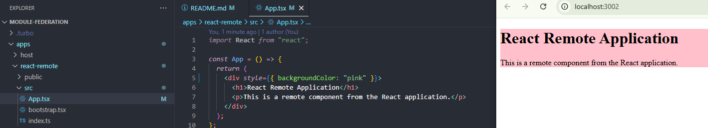
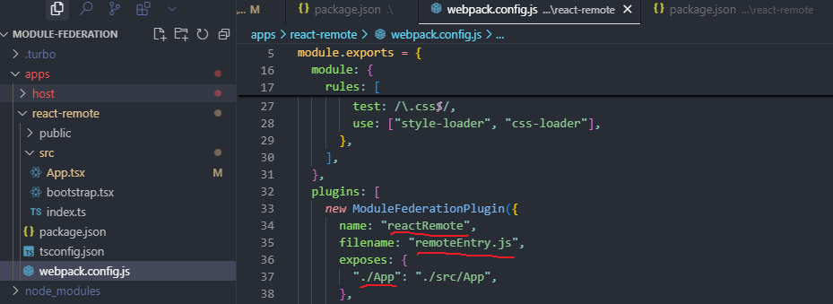

# Module Federation Turborepo

This is a monorepo using Turborepo with Module Federation, containing:

- `apps/host`: React host application (port 3000)
- `apps/react-remote`: React remote application (port 3002)

## Features

- 🚀 **Turborepo** for fast, incremental builds
- 🔄 **Module Federation** for micro-frontend architecture
- ⚛️ **React** for both host and remote applications
- 📦 **Webpack** for bundling

## Getting Started

1. Install dependencies:

```bash
npm install
```

2. Start development servers:

```bash
npm run dev
```

This will start all applications in development mode:

- Host app: http://localhost:3000
- React Remote: http://localhost:3002

## Available Scripts

- `npm run build` - Build all applications
- `npm run dev` - Start all applications in development mode
- `npm run lint` - Run linting
- `npm run clean` - Clean all build artifacts and dependencies
- `npm run format` - Format code with Prettier

## Project Structure

```
├── apps/
│   ├── host/           # React host application
│   │   ├── public/     # Static files
│   │   └── src/        # Source files
│   └── react-remote/   # React remote application
│       ├── public/     # Static files
│       └── src/        # Source files
├── packages/           # Shared packages (if any)
├── package.json        # Root package.json
├── turbo.json         # Turborepo configuration
└── README.md
```

## Module Federation

This project uses Webpack's Module Federation to share components between applications:

- The host application (`apps/host`) consumes components from the remote application
- The remote application (`apps/react-remote`) exposes components to be consumed by the host
- Shared dependencies (React, React DOM) are loaded only once

## Development

1. The host application runs on port 3000 and serves as the main entry point
2. The remote application runs on port 3002 and exposes its components
3. Changes in either application will trigger hot reloading
4. The host application can dynamically load components from the remote application

---

# Hot Reloading

Host app: http://localhost:3000


React Remote: http://localhost:3002


## Modified remote app



Refresh is all that needed to update the host app:


## Code Sharing:

1. Host Component Borrows:

- The host application (apps/host) is borrowing the App component from the remote application (apps/react-remote)
- This is configured in the host's webpack config through the remotes setting:

```js
remotes: {
  reactRemote: "reactRemote@http://localhost:3002/remoteEntry.js"; // import name + host + filename
}
```

```tsx
const ReactRemoteApp = React.lazy(() => import("reactRemote/App"));
```

2. Remote Component Exposed:



> ### Question: Should I always import shared code dynamicky or I can also just import it?

<blockquote>
With Module Federation, you should import shared (remote) code dynamically using React.lazy or a similar dynamic import. For example:

```jsx
const RemoteComponent = React.lazy(() => import("remoteApp/Component"));
```

Why? The remote code is loaded at runtime from another build/bundle.
Static imports (e.g. import { Component } from "remoteApp/Component") will not work, because the code does not exist at build time—it's fetched at runtime.

Summary:  
Remote/shared code: Always import dynamically.  
Local code: You can use static imports as usual.

</blockquote>
